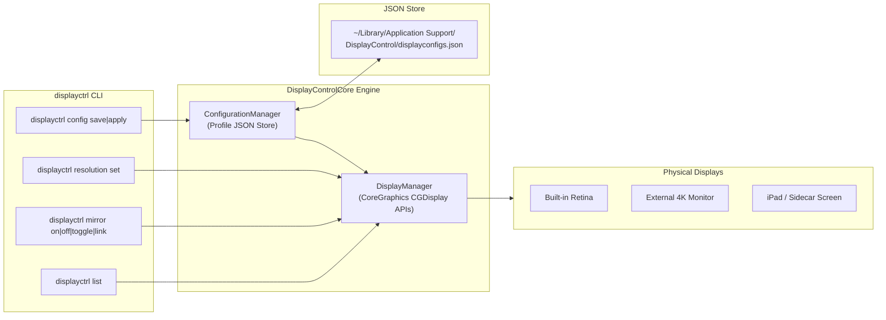

# ``DisplayControlCore``

@Metadata {
    @DisplayName("displayctrl")
    @TitleHeading("Command-Line Tool")
}

A macOS CLI for managing display mirroring, resolution, and persistent multi-monitor configurations.

## Overview

`displayctrl` provides a fast, scriptable command-line interface for managing display hardware on macOS. It combines resolution switching and display mirroring into a single tool, eliminating the need to manually click through System Settings or run multiple disparate utilities.

In addition to direct hardware control, `displayctrl` features a persistent profile engine that captures multi-monitor arrangements to JSON and restores them on demand—using hardware EDID serial numbers so that profiles remain stable across dock reconnects, sleep cycles, and reboots.



---

## Installation

### Homebrew (Recommended)

Install the pre-configured formula directly from the Happitec tap:

```bash
brew install happitec-inc/tap/displayctrl
```

Or tap first and install:

```bash
brew tap happitec-inc/tap
brew install displayctrl
```

### Building from Source

`displayctrl` is built with the Swift Package Manager and requires macOS 14.0+ with Xcode 16.3+ (Swift 6.3):

```bash
git clone https://github.com/happitec-inc/displayctrl.git
cd displayctrl
swift build -c release
cp .build/release/displayctrl /usr/local/bin/displayctrl
```

---

## Core CLI Usage

### 1. Inspecting Displays and Available Modes

To list all connected monitors, their logical indices, active resolutions, and available modes:

```bash
# List all online displays and current modes
displayctrl list

# Aliased shortcut
displayctrl ls
```

Example output:
```text
Display 0: (Main)
  Current Mode: 2560x1440 @ 120Hz
  Available Modes:
    3840x2160 @ 120Hz
    3840x2160 @ 60Hz
    2560x1440 @ 120Hz (active)
    2560x1440 @ 60Hz
    1920x1080 @ 120Hz
Display 1:
  Current Mode: 1920x1080 @ 60Hz
  Available Modes:
    1920x1080 @ 60Hz (active)
    1680x1050 @ 60Hz
```

To check whether display mirroring is currently active:

```bash
displayctrl mirror status
# Mirroring: OFF
```

### 2. Controlling Display Mirroring

`displayctrl` supports both global mirroring (all secondary displays mirror the main display) and selective point-to-point mirror links:

```bash
# Turn global mirroring ON (all monitors mirror the primary display)
displayctrl mirror on

# Turn global mirroring OFF (extended desktop mode)
displayctrl mirror off

# Toggle between mirrored and extended desktop
displayctrl mirror toggle

# Link a specific slave display to mirror a specific master display
displayctrl mirror link 1 0
```

### 3. Setting Resolutions and Refresh Rates

Change the resolution of any display using its logical zero-based index (`0` represents the primary display):

```bash
# Set display 0 to 1920x1080 (automatically picks the highest available refresh rate)
displayctrl resolution set 0 1920 1080

# Explicitly request a 60Hz refresh rate
displayctrl resolution set 0 1920 1080 60

# Configure secondary display 1
displayctrl resolution set 1 2560 1440 120
```

> [!TIP]
> When you omit the refresh rate parameter, `displayctrl` sorts all matching modes in descending order by refresh rate, ensuring that high-refresh displays (such as 120Hz ProMotion screens or 144Hz gaming panels) run at their full potential instead of defaulting to 60Hz.

---

## Configuration Profiles

Manual configuration is useful for one-off adjustments, but moving between environments (desk docks, conference rooms, remote streaming) is best managed with **named configuration profiles**.

### Managing Profiles from the CLI

```bash
# Initialize a sample configuration file with standard presets (ipad, presentation, extended)
displayctrl config init

# Overwrite existing sample profiles if already initialized
displayctrl config init --force

# Save the currently active desktop setup under a custom name
displayctrl config save desk-dock

# List all saved configuration profiles
displayctrl config list

# Inspect details of a specific profile
displayctrl config show desk-dock

# Apply a saved profile instantly
displayctrl config apply desk-dock

# Delete a profile that is no longer needed
displayctrl config delete presentation

# Print the filesystem path to the active configuration file
displayctrl config path
```

---

## What Does a Config File Look Like?

`displayctrl` stores its profiles in human-readable, formatted JSON. You can view the file location with `displayctrl config path`, which defaults to:

```text
~/Library/Application Support/DisplayControl/displayconfigs.json
```

### Annotated Configuration File

Here is an example of a complete `displayconfigs.json` containing three distinct workstation profiles:

```json
{
  "configurations": [
    {
      "name": "ipad",
      "mirroring": "enabled",
      "displays": [
        {
          "index": 0,
          "serialNumber": 18274619,
          "width": 1600,
          "height": 1200,
          "refreshRate": 60.0,
          "mirrorMasterIndex": null,
          "mirrorMasterSerial": null
        }
      ]
    },
    {
      "name": "presentation",
      "mirroring": "enabled",
      "displays": [
        {
          "index": 0,
          "serialNumber": 18274619,
          "width": 1920,
          "height": 1080,
          "refreshRate": 60.0,
          "mirrorMasterIndex": null,
          "mirrorMasterSerial": null
        }
      ]
    },
    {
      "name": "docked-workstation",
      "mirroring": "disabled",
      "displays": [
        {
          "index": 0,
          "serialNumber": 18274619,
          "width": 3840,
          "height": 2160,
          "refreshRate": 120.0,
          "mirrorMasterIndex": null,
          "mirrorMasterSerial": null
        },
        {
          "index": 1,
          "serialNumber": 92837410,
          "width": 2560,
          "height": 1440,
          "refreshRate": 60.0,
          "mirrorMasterIndex": null,
          "mirrorMasterSerial": null
        }
      ]
    }
  ]
}
```

### Anatomy of Configuration Fields

| Field | Type | Description |
| :--- | :--- | :--- |
| `name` | String | Unique profile identifier used with `displayctrl config apply <name>`. |
| `mirroring` | String | Global mirroring mode: `"enabled"` (all displays mirror primary) or `"disabled"` (extended desktop). |
| `displays` | Array | Ordered collection of display targets and their required modes. |
| `index` | Integer | Zero-based logical display index (`0` = primary display). Used as a fallback when serial numbers cannot be matched. |
| `serialNumber` | Integer / null | Physical EDID serial number reported by CoreGraphics (`CGDisplaySerialNumber`). |
| `width` | Integer | Horizontal resolution in pixels. |
| `height` | Integer | Vertical resolution in pixels. |
| `refreshRate` | Double | Active refresh rate in Hertz (e.g. `60.0` or `120.0`). |
| `mirrorMasterIndex` | Integer / null | Logical index of the display this screen should mirror in selective topology setups. |
| `mirrorMasterSerial`| Integer / null | Serial number of the master display for selective topology matching. |

### Why Hardware Serial Numbers Matter

When external monitors are unplugged, replugged, or woken from sleep, macOS does not guarantee that their logical indices (`0`, `1`, `2`) will remain the same. A USB-C monitor that was previously display `1` might enumerate as display `2` after reconnecting a dock.

`displayctrl` queries `CGDisplaySerialNumber` during configuration capture. When applying a configuration, it maps settings to physical hardware monitors by serial number first, only falling back to logical indices if the hardware does not report an EDID serial. This ensures that your secondary monitor never accidentally inherits your primary monitor's resolution.

---

## When and How to Use It

### 1. iPad Sidecar & Remote Screen Streaming

When using an iPad as a secondary screen with Sidecar, Luna Display, or remote desktop streaming, the default desktop resolution can make text blurry or awkwardly proportioned.

* **Goal**: Downscale the main display to a 4:3 aspect ratio matching the iPad and mirror the desktop.
* **Command**:
  ```bash
  displayctrl config apply ipad
  ```
* **Result**: Main display changes to 1600x1200 @ 60Hz and mirroring is engaged. The stream renders pixel-perfect on the iPad display.

### 2. Conference Room & Projector Presentations

Connecting to an HDMI presentation system or boardroom television often defaults to extended desktop mode, leaving slide presenter notes on the wrong screen or projecting at an unsupported refresh rate.

* **Goal**: Force 1080p mirroring at 60Hz across all outputs for instant plug-and-play presentations.
* **Command**:
  ```bash
  displayctrl config apply presentation
  ```

### 3. Multi-Monitor Docking Station

Returning to your home or office desk connected to a multi-monitor Thunderbolt dock.

* **Goal**: Unmirror all screens, set the primary 4K panel to 120Hz, and set the secondary panel to 1440p @ 60Hz.
* **Command**:
  ```bash
  displayctrl config apply docked-workstation
  ```

### 4. Automation with macOS Shortcuts and Shell Scripts

Because `displayctrl` is a clean, self-contained binary with deterministic exit codes, you can invoke it from:
- **macOS Shortcuts App**: Run Shell Script action triggered by Focus modes or peripheral connections.
- **Hammerspoon / Karabiner**: Hotkey bindings for instant display toggles (e.g. `Hyper + D` to toggle mirroring).
- **Network / Sleep Hooks**: Automatic script invocation when connecting to your office Wi-Fi network.

---

## Topics

### Developer Documentation & Architecture
- <doc:Introduction>
- <doc:ManagingDisplayConfigurations>

### Display Hardware APIs
- ``DisplayManager``
- ``DisplayInfo``
- ``DisplayMode``
- ``DisplayError``

### Profile Persistence APIs
- ``ConfigurationManager``
- ``DisplayConfiguration``
- ``ConfigurationError``
