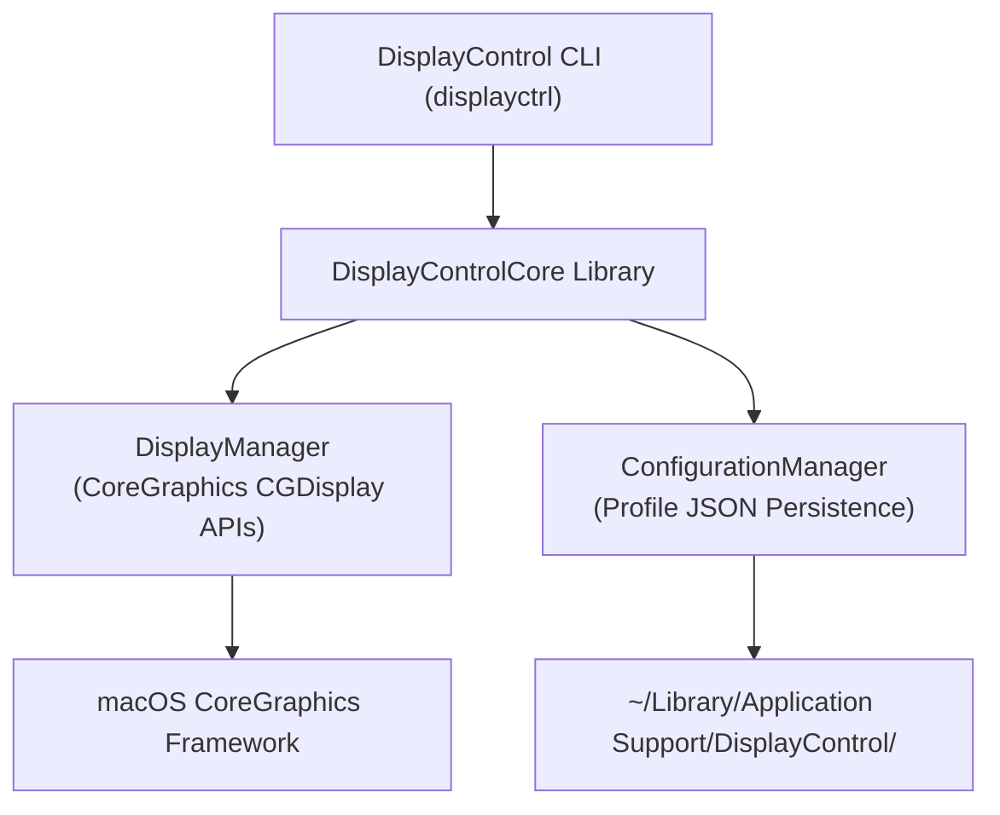

# Introduction to DisplayControl

Modern, scriptable display resolution and mirroring management for macOS.

## 1. Overview and Motivation

Controlling display setups programmatically on macOS has historically required separate, aging command-line utilities or cumbersome manual visits to System Settings. Two distinct open-source projects previously addressed parts of this problem:

1. **[displaymode](https://github.com/p00ya/displaymode)** by Dean Scarff (Apache 2.0): Specialized in querying display modes and applying resolution and refresh rate configurations.
2. **[mirror-displays](https://github.com/fcanas/mirror-displays)** by Fabián Cañas (GPL-3.0): Focused exclusively on establishing and toggling display mirror sets.

While both utilities served their purposes well, each was written as an isolated C/Objective-C command-line tool, lacked hardware-stable display matching across dock reconnects, could not save multi-monitor configurations atomically, and was not consumable as a modern Swift library for higher-level applications (such as Control Center widgets, Shortcuts App Intents, or automation daemons).

`displayctrl` and `DisplayControlCore` unify and modernize these two capabilities into a single, cohesive Swift package designed for macOS 14.0+ and Swift 6.3.

---

## 2. Core Architecture

The package is partitioned into two distinct layers:



### 2.1 DisplayManager: Safe CoreGraphics Integration

`DisplayManager` serves as the primary gateway to macOS display hardware:

- **Online Display Enumeration**: Standard CoreGraphics calls such as `CGGetActiveDisplayList` omit secondary displays when mirroring is active. `DisplayManager` uses `CGGetOnlineDisplayList` to ensure that every connected monitor (both masters and mirror slaves) is recognized and addressable.
- **Memory-Safe CoreFoundation Bridging**: Queries to `CGDisplayCopyAllDisplayModes` return unmanaged CoreFoundation arrays (`CFArray`). `DisplayManager` carefully bridges these opaque pointers into native Swift types using `Unmanaged<CGDisplayMode>.fromOpaque(raw).takeUnretainedValue()`, guaranteeing ARC memory safety.
- **Smart Refresh Rate Selection**: When setting a resolution without specifying an explicit refresh rate, available modes are sorted descending by refresh rate so the highest fidelity mode (e.g. 120Hz ProMotion or 144Hz external panels) is chosen automatically rather than defaulting to 30Hz or 60Hz.

### 2.2 ConfigurationManager: Topology and Hardware Stability

`ConfigurationManager` provides persistent named profiles (e.g., `ipad`, `presentation`, `extended`):

- **Hardware Serial Number Matching**: Logical display indices (0, 1, 2) frequently shift across reboots, sleep cycles, and USB-C hub reconnects. `ConfigurationManager` records the EDID hardware serial number (`CGDisplaySerialNumber`) alongside indices, resolving monitors by physical hardware ID before falling back to array positions.
- **Mirror Topology Preservation**: Rather than treating mirroring as a simple binary switch, configuration profiles capture exact slave-to-master pairings (`mirrorMasterIndex` / `mirrorMasterSerial`). Restoring a configuration recreates the exact topological links without flattening complex multimonitor setups.
- **Accidental Overwrite Protection**: Running `config init` guards against overwriting existing profiles unless explicitly confirmed with `--force`.

---

## 3. Library Integration

To integrate `DisplayControlCore` into your own Swift package or application:

```swift
// Package.swift
dependencies: [
    .package(url: "https://github.com/happitec-inc/displayctrl.git", from: "0.1.0")
]
```

Add `DisplayControlCore` to your target's dependencies:

```swift
.target(
    name: "MyAutomationApp",
    dependencies: [
        .product(name: "DisplayControlCore", package: "displayctrl")
    ]
)
```

### Quick Code Example

```swift
import DisplayControlCore

// Enumerate connected displays
let displays = try DisplayManager.shared.getDisplays()
for display in displays {
    print("Display \(display.index): \(display.currentMode?.description ?? "unknown")")
}

// Switch main display resolution to 1920x1080 at highest refresh rate
try DisplayManager.shared.setMode(displayIndex: 0, width: 1920, height: 1080)

// Save the active setup as a named profile
let profile = try ConfigurationManager.shared.captureCurrentConfiguration(name: "docked-work")
try ConfigurationManager.shared.saveConfiguration(profile)
```

See <doc:ManagingDisplayConfigurations> for a detailed guide on creating, querying, and applying persistent display configurations.
