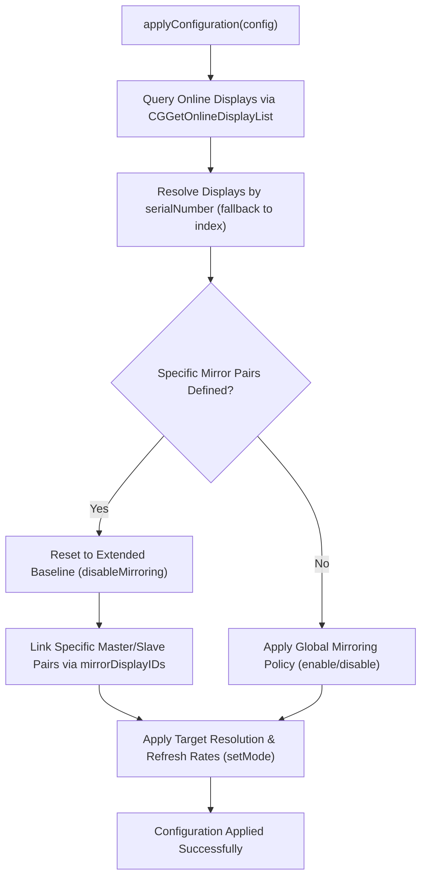

# Managing Display Configurations

Learn how to create, capture, persist, and apply named display configurations across single and multi-monitor macOS environments.

## Overview

A common frustration when using external monitors, iPads via Sidecar, or presentation displays is having to manually re-arrange resolutions and mirroring states whenever hardware is attached or detached.

`DisplayControlCore` solves this through **Named Display Configurations** (`DisplayConfiguration`), managed by `ConfigurationManager`.

---

## 1. Capturing Live Configurations

The fastest way to create a profile is to arrange your displays using macOS System Settings or the `displayctrl` CLI, and then capture the live layout:

```swift
import DisplayControlCore

do {
    let currentProfile = try ConfigurationManager.shared.captureCurrentConfiguration(name: "presentation")
    try ConfigurationManager.shared.saveConfiguration(currentProfile)
    print("Saved profile: \(currentProfile.name)")
} catch {
    print("Failed to capture configuration: \(error)")
}
```

When captured, the profile automatically records:
- **Mirroring State**: Global policy (`.enabled` or `.disabled`) and individual display mirroring links (`mirrorMasterIndex` and `mirrorMasterSerial`).
- **Hardware Metadata**: Logical index and EDID serial numbers (`CGDisplaySerialNumber`).
- **Mode Details**: Pixel width, pixel height, and active refresh rate in Hertz.

---

## 2. Programmatically Defining Configurations

You can also construct configuration profiles manually in Swift code:

```swift
import DisplayControlCore

let dualMonitorSetup = DisplayConfiguration(
    name: "dual-4k-workstation",
    mirroring: .disabled,
    displays: [
        DisplayConfiguration.DisplayConfig(
            index: 0,
            serialNumber: 12345678,
            width: 3840,
            height: 2160,
            refreshRate: 120.0
        ),
        DisplayConfiguration.DisplayConfig(
            index: 1,
            serialNumber: 87654321,
            width: 2560,
            height: 1440,
            refreshRate: 60.0
        )
    ]
)

try ConfigurationManager.shared.saveConfiguration(dualMonitorSetup)
```

---

## 3. Applying Configurations Safely

When applying a configuration with `ConfigurationManager.shared.applyConfiguration(named:)`, the manager handles physical hardware matching in stages:



```swift
import DisplayControlCore

do {
    try ConfigurationManager.shared.applyConfiguration(named: "dual-4k-workstation")
    print("Workstation configuration applied.")
} catch ConfigurationError.notFound(let name) {
    print("Profile '\(name)' does not exist.")
} catch {
    print("Error applying configuration: \(error)")
}
```

---

## 4. Initializing Sample Configurations

To seed default configurations for users or CLI workflows:

```swift
import DisplayControlCore

// Attempt to create sample configs (throws ConfigurationError.alreadyExists if file contains profiles)
do {
    try ConfigurationManager.shared.createSampleConfiguration(force: false)
} catch ConfigurationError.alreadyExists {
    // Force overwrite if desired
    try ConfigurationManager.shared.createSampleConfiguration(force: true)
}
```

The sample set includes three profiles:
- **`ipad`**: 1600x1200 at 60Hz with mirroring enabled.
- **`presentation`**: 1920x1080 at 60Hz with mirroring enabled.
- **`extended`**: Dual display layout (2560x1440 and 1920x1080) with mirroring disabled.

---

## 5. Storage Location and Inspecting Profiles

Configurations are stored on disk in formatted, pretty-printed JSON at:

```
~/Library/Application Support/DisplayControl/displayconfigs.json
```

You can obtain the exact URL in code:

```swift
let fileURL = ConfigurationManager.shared.configFileURL
print("Config file path: \(fileURL.path)")
```
